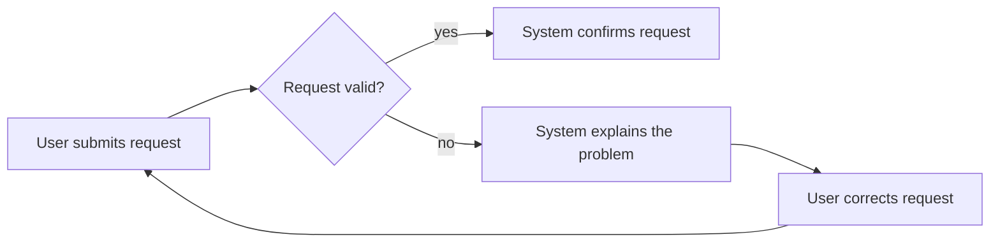

# Mermaid user flows

Use Mermaid for behavior: actors, user actions, system responses, decisions, and failure paths. Keep the diagram source portable so Astra can render it locally in the review console.

## Choose the artifact

Use this skill for CLI, API, backend, data, automation, and other non-visual stories. For a story that includes a graphical component, emit the flow with Mermaid and let Astra select the OpenPencil UI artifact as the second presentation. Do not replace a UI demonstration with a diagram.

The User Story artifact must contain one Mermaid source string. Keep the source in the schema's Mermaid field; do not create a standalone file unless the gate contract explicitly requests one.

## Write the flow

1. Start with `flowchart LR` for a journey or `flowchart TD` for a decision tree.
2. Give every node a stable, semantic id and a short quoted label: `user["User submits request"]`.
3. Connect actions in causal order. Label branches with quoted outcomes such as `|valid|` and `|rejected|`.
4. Group an external actor or subsystem with `subgraph` only when it clarifies ownership.
5. Include the happy path plus each meaningful validation, retry, denial, or recovery path.

Example:

## Keep source safe and renderable

- Emit flowchart syntax supported by the pinned `mermaid` package (`11.17.2`); do not use experimental diagrams or unsupported directives.
- Keep labels plain text. Escape quotes and line breaks correctly when embedding the source in JSON.
- Do not embed HTML, JavaScript, CSS, `click` callbacks, external images, arbitrary URLs, or executable expressions.
- Keep styling minimal and optional; meaning belongs in node labels and edges, not color alone.
- Validate that every edge points to a declared node and that the flow contains at least one user action and one observable outcome.
