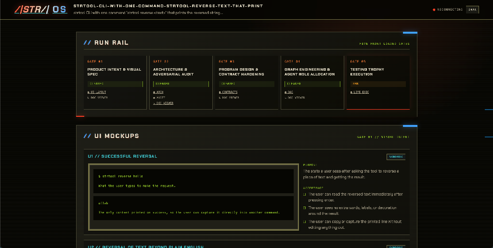
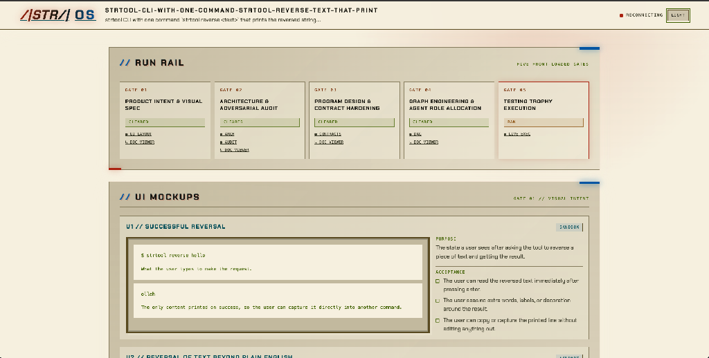
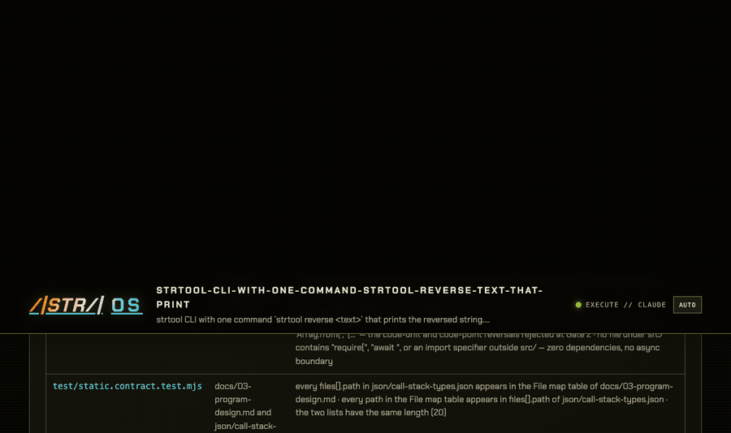

**A portable, spec-driven session broker for the coding harness you already use.**

| Dark — Horizon graphite / bone / lime | Light — same tokens, inverted |
| --- | --- |
|  |  |

---

Astra OS is a portable agent harness. It drives Pi natively through its TypeScript SDK, or the coding CLI you already use (`claude`, `droid`, `opencode`, `hermes`, or `codex`), through five front-loaded spec-driven development gates. A durable session record connects the chosen harness to the GUI or host TUI, tracks coordinator and worker sessions, calculates token-budget progress, and preserves human approval between gates.

The premise, started from a journey into harness orchestration, graph engineering, and Spec Driven Development: codebase rot comes from letting agents skip design. So design is front-loaded, gated, and machine-checked. An announced-but-unrun gate is impossible, because every gate block is rendered from artifacts on disk rather than typed by the agent.

## Install

```bash
npx @ninjamin/astra-os          # installs the stella + grunt + mermaid + open-pencil skills for detected hosts, registers Astra MCP, builds the role map
npm i -g @ninjamin/astra-os     # or install the astra CLI globally (preferred)
```

Also installable as a plugin: `.claude-plugin/`, `.codex-plugin/`, and `plugin.source.json` ship in the package, with `skills/`, `commands/`, and `agents/` wired up.

Claude Code, Factory Droid, and Codex can also drive Astra through its MCP bridge. Installing the package runs a safe postinstall: detected hosts receive the Stella, Grunt, Mermaid, and OpenPencil skills, and the Astra MCP server is registered with the host's official interface when available. Existing MCP conflicts are preserved with a warning; missing hosts are skipped. See `docs/harnesses/mcp.md`.

## Quickstart

```bash
astra doctor                                    # which agent CLIs are on PATH
astra start "add usage-based billing" --agent pi --judge magi --budget-tokens 200000
astra run                                       # Gate 1: product intent + User Story
astra session                                   # harness route, workers, token calculations
astra viz                                       # open the retro review console
astra approve product && astra advance          # human clears the gate
astra run                                       # Gate 2 …
```

## The five gates

| # | Gate | Role | Artifacts |
|---|---|---|---|
| 1 | Product Intent & User Story | Product Architect | `docs/01-product.md`, `json/user-story.json` |
| 2 | Architecture & Adversarial Audit | System Designer + grunt / MAGI | `docs/02-architecture.md`, `json/system-architecture.json`, `json/audit.json` |
| 3 | Program Design & Contract Hardening | Program Designer | `docs/03-program-design.md`, `json/call-stack-types.json` |
| 4 | Graph Engineering & Role Allocation | Graph Engineer | `docs/04-slices.md`, `PLAN.md`, `json/plan.json` |
| 5 | Testing Trophy Execution | Slice workers | `json/dag-execution.json`, `00-status.md` |

Everything lands under `.astra/<slug>/`. The ledger is `status.json`; its human mirror is `00-status.md`.

**Gate 1** bans technical jargon outright — no frameworks, endpoints, schemas, or file paths in prose. It emits `user-story.json` with a Mermaid.js interaction flow for every story. Stories containing a graphical component additionally produce an editable OpenPencil `.fig` design and PNG preview; non-UI stories stay flow-only. The visualizer renders the flow locally and opens UI previews in the same pop-out document viewer.

**Gate 2** designs service fit, interfaces, data model, and sequence flows including failure paths, then hands the design to an adversarial reviewer before any human reads it. `--judge solo` runs one skeptic; `--judge magi` runs Melchior, Balthasar, and Casper independently. Personas each write one findings file; the harness merges them arithmetically, so an unresolved `P0` rejects the gate no matter what the personas declared. Findings land in `system-architecture.json` as `riskFlags`, rendered beside the flow they attack.

**Gate 3** writes contracts, not code: exact file paths, full type declarations, function signatures with no bodies, call stacks, error contract, and per-layer test assertions. Every path it names becomes a write boundary at Gate 5 — a path missing here cannot be written later.

**Gate 4** decomposes slices into a DAG. Each node carries its own scoped role: an ≤80-word system prompt, a write boundary drawn only from the Gate 3 contract, and declared inputs and outputs. The tracer slice lands first.

**Gate 5** runs the graph through the Testing Trophy: `static` (lint + type/AST), `unit` (isolated domain calculations), `integration` (DB, API, cross-component with real wiring — the heaviest layer), and `e2e` (one traced path per slice). A slice whose last node is `implement` is rejected at Gate 4 validation. State streams to the visualizer on every transition.

## One coordinator, focused subagents

The selected harness owns one coordinator session across the pipeline. Astra uses a read-only scout before Gate 1, runs MAGI judges independently in parallel, and gives each Gate 5 DAG node a focused worker session. The coordinator retains the plan and compresses its context when usage reaches 50%; workers stay scoped to their task and write boundary. Astra never enables unrestricted auto-run flags; risky commands pause for an explicit response.

Worker defaults favor capable, economical models: Claude requests `claude-sonnet-5` at medium effort; Codex and Droid request `gpt-5.6-luna` at max effort; OpenCode, Hermes, and Pi inherit their configured default. If a pinned model is unavailable, the adapter falls back to that harness's default and records a visible warning instead of hiding the downgrade.

| Agent CLI | Headless invocation | Notes |
|---|---|---|
| `claude` | `claude -p "$PROMPT"` | Permission-aware long-horizon reasoning gates |
| `droid` | `droid exec "$PROMPT"` | Permission-aware vertical-slice generation |
| `opencode` | `opencode run --quiet "$PROMPT"` | Pragmatic audits, script generation |
| `hermes` | `hermes chat --system "$ROLE" --message "$PROMPT"` | Native system-prompt slot |
| `codex` | prompt over stdin to `codex exec` | Durable thread metadata, focused workers |

Pick with `--agent`. Pi uses the native SDK in-process; the other adapters use their installed CLIs and retain native session identifiers where supported. Adapters normalize token usage into the broker without maintaining a pricing database or enforcing spend. Adapters live in `lib/adapters.mjs`.

## Write boundaries are enforced, not requested

Git is the witness. Before and after every Gate 5 node, Astra diffs `git status --porcelain`; a fresh file outside that node's `role.writeBoundary` fails the node. A node that cannot finish inside its boundary prints `BLOCKED: <reason>`, which is a correct outcome. Widening the boundary is not.

## Roles

Thirteen roles ship vendored in `agents/` — five gate roles, four grunt personas, four Testing Trophy workers — so a run never depends on an external marketplace. `astra roles scan` additionally indexes external roots (`~/.claude/agents`, a wshobson-style marketplace, `~/.factory/droids`) into a lean map at `~/.astra/map/`. At Gate 5 a matching specialist is hydrated *on top of* the vendored worker for domain depth. Nothing is installed, and no ambient context is spent until spawn time.

```bash
astra roles scan
astra roles list
astra roles show astra-integration-verifier
```

## grunt

`grunt` is Astra's adversarial reviewer, with its catalogs, judge protocol, and MAGI tribunal intact: pattern selection by observed pressure, rejection with the missing evidence named, a grounding taxonomy where a `claim` needs `file:line` and a `guess` is always low confidence, and the P0/P1/P2 severity ladder. It runs at Gate 2 and can be invoked directly for design or code review.

## Runtime

The DAG scheduler sits behind one interface so it can be swapped without touching gates, prompts, or artifacts:

```js
runGraph({ plan, execute, concurrency, maxAttempts, hooks }) -> { status, results }
```

`--runtime local` (default) is the bundled in-process wave scheduler: dependency-ordered waves, bounded concurrency, one retry per node, and failed nodes blocking only their dependents.

`--runtime langgraph` compiles the same plan into a LangGraph.js graph, so you get its streaming, checkpointing, and LangSmith tracing. Each wave is fanned out from a barrier node instead of wiring dependencies as direct edges — LangGraph fires a node as soon as any incoming edge fires, so dependencies landing in different supersteps would otherwise run a node twice. Blocking, retries, and the concurrency cap match the local runtime exactly (`test/runtime-langgraph.test.mjs` asserts parity).

```bash
npm install @langchain/langgraph          # optional peer dependency
astra start "…" --runtime langgraph       # astra doctor shows which runtimes are ready
```

## Visualizer

`astra start` opens the GUI automatically from an interactive terminal; `--no-gui` keeps the host CLI as the TUI, and `--gui` forces the console. `astra viz` serves a 1980s-retro review console (Chakra Petch, CRT scanlines, neon) that reads the run root and streams session, budget, worker, and gate updates over SSE. Approve or request changes per gate from the footer. Risky commands and agent input waits render as live interaction cards with allow, deny, or answer controls.

Every Markdown file in the run root is rendered as HTML (headings, tables, code, lists) and each one pops out into a full-width modal, so a 36 KB program design is readable without leaving the console. A `TRANSCRIPT` panel tails the last 50 lines of whichever agent-CLI log is currently being written — that output never reaches your TUI, since the harness drives the CLI headlessly.



## Recruiter showcase

`site/` is a standalone ASTRA-styled product page with an authored five-gate story, accessible finite GSAP motion, structured product/how-to/FAQ data, and no dependency on a live run. Launch or deploy it alongside Astra:

```bash
npm run site:dev       # Cloudflare local preview
npm run site:deploy    # deploy static assets to workers.dev
```

GitHub Actions deploys the site from `main` when `site/` or its Wrangler config changes. Add `CLOUDFLARE_API_TOKEN` and `CLOUDFLARE_ACCOUNT_ID` as secrets on the `cloudflare` GitHub environment; the workflow verifies the full test suite before deploying with Wrangler.

## Releases

The package is currently version `0.2.2`. A matching semantic version tag runs two release workflows: one packages the tested artifact and creates the GitHub release, while the other publishes the same package version to npm with provenance through trusted publishing.

```bash
npm test
git tag v0.2.2
git push origin v0.2.2
```

Configure npm trusted publishing for repository `justjammin/ASTRA_OS`, workflow `npm-publish.yml`, and environment `npm-release`. Both workflows refuse tags that do not match `package.json`; npm publishing uses short-lived GitHub OIDC credentials instead of a stored npm token.

## Commands and exit codes

```
astra                                install skills, plugin files, and the role map
astra start "<intent>"               [--agent …] [--judge solo|magi] [--runtime local|langgraph]
                                     [--budget-tokens N] [--gui|--no-gui] [--out <dir>]
astra run [--all] [--dry-run]        drive the current gate
astra session [--json]               harness route, workers, and token calculations
astra mcp                            MCP stdio server for host harnesses
astra respond <request-id>           resolve a pending command/input wait
astra gate [<gate>]                  validate a gate from disk
astra approve <gate>                 human-only
astra advance                        next gate
astra loop --to=<gate> --reason="…"  rework (budget 2 per gate)
astra status [--json] | astra viz | astra roles | astra doctor | astra complete
```

| Code | Meaning |
|---|---|
| 0 | Gate satisfied or transition performed |
| 1 | Artifacts missing or invalid — the output names each failure |
| 2 | Loop budget exhausted — escalate to the human |
| 3 | Transition refused: wrong phase, gate open, no active run |
| 4 | Human-only action attempted by an agent |

## Development

```bash
npm test          # node --test, zero dependencies
node visualizer/server.mjs .astra/<slug>
```

Node >= 22.19, ESM throughout. Pi, Mermaid.js (`11.17.2`), OpenPencil CLI (`0.14.0`), and runtime-schema support ship as dependencies; LangGraph.js remains an optional peer. Schemas in `lib/schemas/` are the artifact contract; the validator in `lib/validate.mjs` implements the subset they use.

## License

Apache-2.0 — see [LICENSE](LICENSE). Wordmark glyphs are Chakra Petch Bold, converted to outlines, under the SIL Open Font License 1.1.
